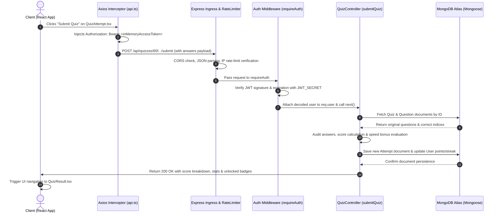

# 🏛️ TechQuiz AI - System Architecture & Engineering Deep-Dive

This document provides a comprehensive, production-grade architectural analysis of the **TechQuiz AI** platform. It is structured to answer all technical system design, request lifecycle, data flow, security, and component breakdown questions encountered in Senior Software Development Engineer (SDE) interviews.

---

## 📑 Table of Contents
1. [High-Level Architecture Overview](#1-high-level-architecture-overview)
2. [Tech Stack Breakdown (Frontend, Backend, Database)](#2-tech-stack-breakdown)
3. [Separation of Concerns: Controllers, Services & Models](#3-separation-of-concerns-controllers-services--models)
4. [End-to-End Request Lifecycle (How a Request Travels)](#4-end-to-end-request-lifecycle)
5. [Frontend-to-Backend Communication Protocols](#5-frontend-to-backend-communication-protocols)
6. [Dual-Token Authentication & Session Management](#6-dual-token-authentication--session-management)
7. [Resilience & Production Engineering Innovations](#7-resilience--production-engineering-innovations)
8. [SDE Interview Q&A Quick Reference](#8-sde-interview-qa-quick-reference)## 1. High-Level Architecture Overview

TechQuiz AI is built on a **modern decoupled client-server architecture** with RESTful endpoints, scheduled background workers, and resilient LLM integrations:

```
                       ┌──────────────────────────────────────────────────────────┐
                       │                     CLIENT (BROWSER)                     │
                       │   React 19 + TypeScript + Vite + Tailwind CSS v4         │
                       │   State: React Context (Auth)                            │
                       │   Data: Axios (In-Memory JWT)                            │
                       └──────────────────────────┬───────────────────────────────┘
                                                  │ HTTP / REST
                                                  │ (Bearer JWT / Cookies)
                                                  ▼
┌─────────────────────────────────────────────────────────────────────────────────┐
│                           BACKEND RUNTIME (Node.js + Express)                    │
│                                                                                 │
│   ┌─────────────────────────────────────────────────────────────────────────┐   │
│   │ Middleware Pipeline: CORS -> express.json -> rateLimiter -> requireAuth │   │
│   └────────────────────────────────────┬────────────────────────────────────┘   │
│                                        ▼                                        │
│   ┌─────────────────────────────────────────────────────────────────────────┐   │
│   │ Controllers: authController | quizController | aiController | userCtrl  │   │
│   └──────────────┬─────────────────────────────┬────────────────────────────┘   │
│                  ▼                             ▼                                │
│   ┌──────────────────────────────┐ ┌────────────────────────────────────────┐  │
│   │ Services & Background Tasks  │ │ Mongoose 8 ORM Data Layer              │  │
│   │ - cronService (Midnight cron)│ │ - User, Quiz, Question, Attempt        │  │
│   │ - pdfService (Puppeteer)     │ │ - Session, Otp (TTL), Badge, Chat      │  │
│   │ - gemini failover rotator    │ └───────────────────┬────────────────────┘  │
│   └──────────────┬───────────────┘                     │                        │
└──────────────────┼─────────────────────────────────────┼────────────────────────┘
                   │                                     │
                   ▼                                     ▼
      ┌─────────────────────────┐           ┌─────────────────────────┐
      │ Google Gemini 2.5 Flash │           │ MongoDB Atlas Database  │
      │ Multi-Key API Rotator   │           │ (Persistent Data + TTL) │
      └─────────────────────────┘           └─────────────────────────┘
```

---

## 2. Tech Stack Breakdown

### Frontend Layer
- **Framework**: **React 19** with **TypeScript** and **Vite** bundler for lightning-fast HMR and optimized asset compilation.
- **Styling & UI/UX**: **Tailwind CSS v4** coupled with **Framer Motion** for smooth 60fps micro-animations, glassmorphism cards, and responsive dark-mode layouts.
- **Data Visualization**: **Recharts** for candidate skill-gap radar charts, accuracy percentage breakdowns, and historical score trend lines.
- **Icons**: **Lucide React** for consistent vector iconography.
- **State Management**: Specialized React Context Provider ([`AuthContext.tsx`](file:///d:/Antigravity_Workspace/01_TechQuiz_AI/frontend/src/context/AuthContext.tsx)) to cleanly isolate authentication state.

### Backend Layer
- **Runtime & Web Framework**: **Node.js (v18+)** and **Express.js (v4.19)** written in strictly-typed TypeScript.
- **Document Engine**: **Puppeteer** running headless Chrome to dynamically render responsive HTML/CSS study templates into styled, downloadable A4 PDF documents.
- **Background Scheduler**: **Node-Cron** executing midnight cron jobs (`0 0 * * *`) that auto-generate daily challenges across rotating technical topics.i 2.5 Flash │           │ MongoDB Atlas Database  │
      │ Multi-Key API Rotator   │           │ (Persistent Data + TTL) │
      └─────────────────────────┘           └─────────────────────────┘
```

---

## 2. Tech Stack Breakdown

### Frontend Layer
- **Framework**: **React 19** with **TypeScript** and **Vite** bundler for lightning-fast HMR and optimized asset compilation.
- **Styling & UI/UX**: **Tailwind CSS v4** coupled with **Framer Motion** for smooth 60fps micro-animations, glassmorphism cards, and responsive dark-mode layouts.
- **Data Visualization**: **Recharts** for candidate skill-gap radar charts, accuracy percentage breakdowns, and historical score trend lines.
- **Icons**: **Lucide React** for consistent vector iconography.
- **State Management**: Specialized React Context Providers ([`AuthContext.tsx`](file:///d:/Antigravity_Workspace/01_TechQuiz_AI/frontend/src/context/AuthContext.tsx) and [`SocketContext.tsx`](file:///d:/Antigravity_Workspace/01_TechQuiz_AI/frontend/src/context/SocketContext.tsx)) to cleanly isolate auth state and real-time multiplayer subscriptions.

### Backend Layer
- **Runtime & Web Framework**: **Node.js (v18+)** and **Express.js (v4.19)** written in strictly-typed TypeScript.
- **Real-Time Engine**: **Socket.IO (v4.7)** managing low-latency multiplayer rooms, 6-digit lobby codes, live matchmaking, countdown timers, and live score synchronization.
- **Document Engine**: **Puppeteer** running headless Chrome to dynamically render responsive HTML/CSS study templates into styled, downloadable A4 PDF documents.
- **Background Scheduler**: **Node-Cron** executing midnight cron jobs (`0 0 * * *`) that auto-generate daily challenges across rotating technical topics.

### Database Layer
- **Database**: **MongoDB Atlas** (Cloud NoSQL document store).
- **Object Data Modeling (ODM)**: **Mongoose 8** with strict schema definitions, compound indexes for fast leaderboards, and automated **TTL (Time-To-Live) indexes** for self-expiring OTPs and sessions.

### Generative AI Layer
- **Model**: **Google Gemini 2.5 Flash** (`@google/genai` SDK v2.8).
- **Reliability Layer**: Custom multi-key round-robin rotator with jittered exponential backoff for graceful rate-limit handling.

---

## 3. Separation of Concerns: Controllers, Services & Models

The backend strictly follows a layered architectural pattern to keep responsibilities clean and maintainable:

```
[Inbound Request] ──► [Middleware Pipeline] ──► [Routes] ──► [Controllers] ──► [Services / Models] ──► [Database / External API]
```

### 1. Routes & Middleware Layer
* **Files**: [`app.ts`](file:///d:/Antigravity_Workspace/01_TechQuiz_AI/backend/src/app.ts), [`routes/`](file:///d:/Antigravity_Workspace/01_TechQuiz_AI/backend/src/routes), [`middleware/auth.ts`](file:///d:/Antigravity_Workspace/01_TechQuiz_AI/backend/src/middleware/auth.ts), [`middleware/rateLimiter.ts`](file:///d:/Antigravity_Workspace/01_TechQuiz_AI/backend/src/middleware/rateLimiter.ts)
* **Responsibility**: Ingress validation, CORS enforcement, request rate limiting, JWT token extraction, and Role-Based Access Control (`requireAuth`, `requireAdmin`).

### 2. Controllers Layer
* **Files**: [`authController.ts`](file:///d:/Antigravity_Workspace/01_TechQuiz_AI/backend/src/controllers/authController.ts), [`quizController.ts`](file:///d:/Antigravity_Workspace/01_TechQuiz_AI/backend/src/controllers/quizController.ts), [`aiController.ts`](file:///d:/Antigravity_Workspace/01_TechQuiz_AI/backend/src/controllers/aiController.ts), [`userController.ts`](file:///d:/Antigravity_Workspace/01_TechQuiz_AI/backend/src/controllers/userController.ts)
* **Responsibility**: HTTP request orchestration. Controllers extract parameters (`req.params`, `req.body`, `req.user`), call relevant services or models, handle business validation, and return standard structured JSON responses with appropriate HTTP status codes.

### 3. Services Layer
* **Files**: [`cronService.ts`](file:///d:/Antigravity_Workspace/01_TechQuiz_AI/backend/src/services/cronService.ts), [`pdfService.ts`](file:///d:/Antigravity_Workspace/01_TechQuiz_AI/backend/src/services/pdfService.ts), [`gemini.ts`](file:///d:/Antigravity_Workspace/01_TechQuiz_AI/backend/src/config/gemini.ts)
* **Responsibility**: Decoupled, heavy business logic and background processing:
  * `cronService.ts`: Runs background cron triggers, checks seed state, and calls AI generators for daily quizzes.
  * `pdfService.ts`: Spins up headless Puppeteer browsers, generates styled print layouts, and compiles binary PDF streams.
  * `gemini.ts`: Manages the API key rotator and failover execution logic (`withGeminiFailover`).

### 4. Models & Data Layer
* **Files**: [`User.ts`](file:///d:/Antigravity_Workspace/01_TechQuiz_AI/backend/src/models/User.ts), [`Quiz.ts`](file:///d:/Antigravity_Workspace/01_TechQuiz_AI/backend/src/models/Quiz.ts), [`Question.ts`](file:///d:/Antigravity_Workspace/01_TechQuiz_AI/backend/src/models/Question.ts), [`Attempt.ts`](file:///d:/Antigravity_Workspace/01_TechQuiz_AI/backend/src/models/Attempt.ts), [`Session.ts`](file:///d:/Antigravity_Workspace/01_TechQuiz_AI/backend/src/models/Session.ts), [`Otp.ts`](file:///d:/Antigravity_Workspace/01_TechQuiz_AI/backend/src/models/Otp.ts), [`Badge.ts`](file:///d:/Antigravity_Workspace/01_TechQuiz_AI/backend/src/models/Badge.ts), [`Chat.ts`](file:///d:/Antigravity_Workspace/01_TechQuiz_AI/backend/src/models/Chat.ts)
* **Responsibility**: Database schemas, relations, field validations, and custom MongoDB indexes (e.g. compound indices for leaderboards and TTL indexes for auto-expiring documents).

---

## 4. End-to-End Request Lifecycle

### Tracing a Request: Submitting a Quiz Attempt (`POST /api/quizzes/:id/submit`)



---

## 5. Frontend-to-Backend Communication Protocols

The application utilizes two specialized communication mechanisms:

1. **REST API over Axios with In-Memory Tokens ([`api.ts`](file:///d:/Antigravity_Workspace/01_TechQuiz_AI/frontend/src/utils/api.ts))**:
   * Used for CRUD operations, quiz evaluation, analytics, AI generation, and admin tasks.
   * `withCredentials: true` ensures HttpOnly refresh cookies are automatically passed on cross-origin requests.
   * Request interceptor automatically attaches the in-memory access token as `Bearer <token>`.
2. **Binary Streaming Pipeline ([`pdfService.ts`](file:///d:/Antigravity_Workspace/01_TechQuiz_AI/backend/src/services/pdfService.ts))**:
   * Generates dynamic A4 PDF study guides on the server and streams raw `application/pdf` binary data to the browser for instant download.

---

## 6. Dual-Token Authentication & Session Management

```
                       ┌────────────────────────────────────────┐
                       │               User Login               │
                       └───────────────────┬────────────────────┘
                                           │
                        ┌──────────────────┴──────────────────┐
                        ▼                                     ▼
             [Access Token (JWT)]                  [Refresh Token (JWT)]
             - Lifetime: 15 minutes                - Lifetime: 7 days
             - Stored: IN-MEMORY ONLY              - Stored: HttpOnly, Secure Cookie
             - Attached: 'Bearer' Header           - Tracked: MongoDB Session Collection
                        │                                     │
                        │                                     │
     ┌──────────────────┴──────────────────┐                  │
     ▼                                     ▼                  │
API Request (200 OK)              401 Token Expired           │
                                           │                  │
                                           ▼                  ▼
                                ┌────────────────────────────────────────┐
                                │ Axios Interceptor: POST /auth/refresh  │
                                │ (Presents HttpOnly Refresh Cookie)     │
                                └──────────────────┬─────────────────────┘
                                                   │
                                                   ▼
                                        Issues fresh Access Token
                                        & Rotates Refresh Cookie
```

### Security Architecture Details:
1. **Access Tokens**: Short-lived (15 min) JWT stored strictly in JavaScript in-memory variables—never written to `localStorage` or `sessionStorage` (preventing XSS token extraction).
2. **Refresh Tokens**: Long-lived (7 days) JWT stored in an `HttpOnly`, `Secure`, `SameSite: Strict` cookie (inaccessible to JavaScript, defending against CSRF and XSS).
3. **Transparent Auto-Refresh Interceptor**:
   * When an API request encounters a `401 Unauthorized`, the Axios response interceptor intercepts the failure.
   * It silently invokes `POST /api/auth/refresh` (which reads the HttpOnly cookie), gets a new access token, updates the in-memory variable, and transparently retries the original request without disrupting the user.
4. **Session Auditing & Revocation**:
   * Every login creates a record in the [`Session.ts`](file:///d:/Antigravity_Workspace/01_TechQuiz_AI/backend/src/models/Session.ts) collection containing user IP, User-Agent, and token signature.
   * Logging out or deleting a session immediately invalidates the corresponding refresh token.
5. **Two-Factor Email OTP Verification**:
   * Registrations generate a 6-digit OTP stored as a **SHA-256 hash** in [`Otp.ts`](file:///d:/Antigravity_Workspace/01_TechQuiz_AI/backend/src/models/Otp.ts).
   * Backed by a **10-minute MongoDB TTL index** that automatically purges expired records at the database engine level.

---

## 7. Resilience & Production Engineering Innovations

### 1. Multi-Key Gemini API Failover Rotator ([`gemini.ts`](file:///d:/Antigravity_Workspace/01_TechQuiz_AI/backend/src/config/gemini.ts))
* **Problem**: Free-tier Gemini AI enforces strict 15 RPM (Requests Per Minute) limits. Spikes in question generation or student doubts can cause `429 Too Many Requests`.
* **Solution**: The backend registers an array of fallback API keys (`GEMINI_KEY_1`, `GEMINI_KEY_2`, `GEMINI_KEY_3`, `GEMINI_API_KEY`).
* **Implementation**: The `withGeminiFailover()` wrapper intercepts transient `429`, `503`, or authentication errors, applies **jittered exponential backoff**, rotates to the next active key, and transparently retries.

### 2. Native Schema-Enforced AI Outputs
* **Problem**: LLMs often return unstructured markdown, leading to JSON parsing errors in automated pipelines.
* **Solution**: AI generation endpoints use Gemini’s native `responseSchema` configuration to enforce strict structural adherence (4 options, 0-based integer answer index, explanation, difficulty, and points), eliminating runtime parsing failures.

### 3. Server-Side Puppeteer PDF Compilation Engine ([`pdfService.ts`](file:///d:/Antigravity_Workspace/01_TechQuiz_AI/backend/src/services/pdfService.ts))
* **Problem**: Client-side HTML2Canvas or jsPDF prints produce blurry text and poor page-break formatting.
* **Solution**: High-performance headless Puppeteer renders responsive HTML/CSS print templates directly on the backend, outputting crisp vector PDFs.

---

## 8. SDE Interview Q&A Quick Reference

### Q1: Why use in-memory JWT storage instead of localStorage?
> **Answer**: `localStorage` is vulnerable to Cross-Site Scripting (XSS)—any injected third-party script can steal tokens. By keeping the short-lived access token in-memory and the refresh token in an `HttpOnly`, `Secure` cookie, JavaScript has zero direct access to long-lived credentials, providing defense-in-depth against both XSS and CSRF.

### Q2: How do you handle database scaling for high-concurrency quiz submissions?
> **Answer**: Quiz attempts only record answers and compute scores after submission, minimizing database lock contention. Leaderboards and user analytics use indexed queries on `userId`, `quizId`, and `score`. Ephemeral OTPs and sessions use MongoDB TTL indexes, delegating background cleanup to the MongoDB storage engine without custom polling scripts.

### Q3: How do you handle third-party LLM rate limits gracefully?
> **Answer**: We use a round-robin Multi-Key API Rotator wrapped in a jittered exponential backoff retrier. If a key encounters a 429 rate limit, the service waits with a randomized delay, switches to the next healthy key, and transparently completes the user request.
